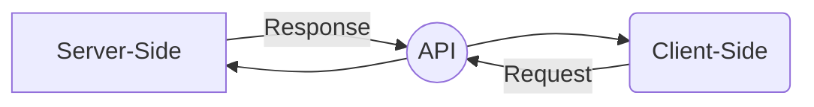
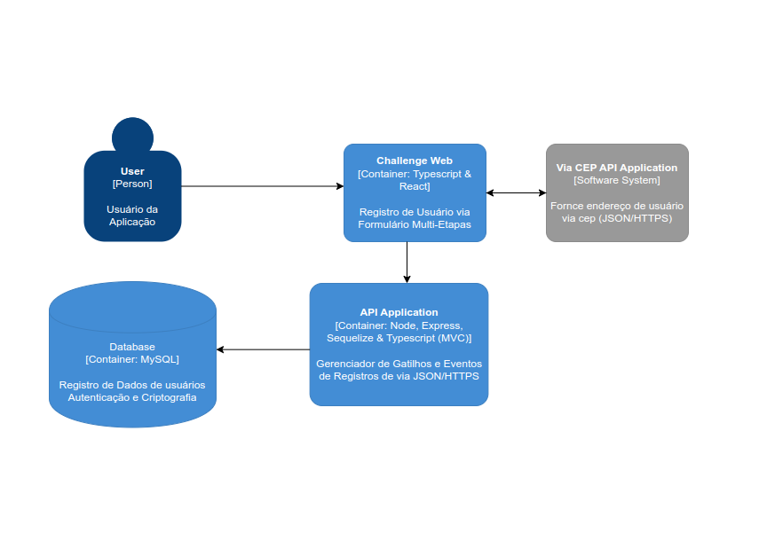
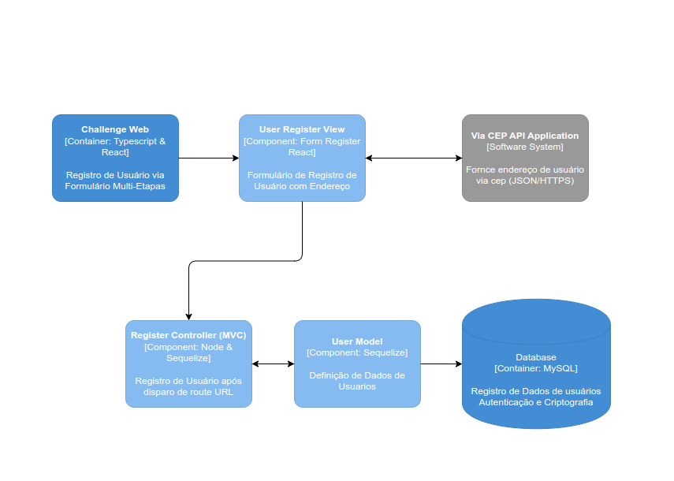
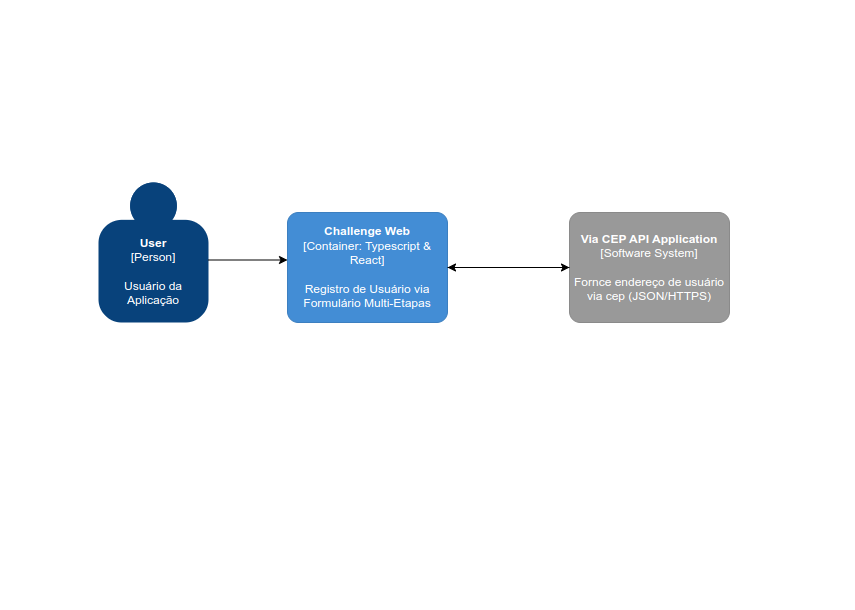

# Challenge Bemol

Este é um desafio para **Software Engineer**. Trata-se da implementação de uma feature de cadastro de usuário com dois pacotes principais listados abaixo: 
- **API:** um App NodeJs com Sequelize ORM que disponibiliza uma rota de cadastro para o cliente web ([Veja mais detalhes](./packages/api/README.md))
	> 
- **Web:** fornece uma interface interativa de cadastro através de um formulário multi-etapas utilizando a API ([Veja mais detalhes](./packages/web/README.md)) 

## Features

 - [x] Cadastro de Usuário
 - [x] Validação de Input
 - [x] Criptografia
 - [x] Geração de Token 
 - [x] Interface Intuitiva
 - [x] Consumo de API
 - [x] Roteamento de Páginas

## Arquitetura
Tratando-se da relação de um ***server-side*** x ***client-side.*** O  server-side é responsável por fornecer os *endpoints* necessários para o client-side, gerenciar as regras de negócios e manter a base de dados, a ***API (Application Programming Interface)*** é o meio de comunicação entre os dois extremos, sendo essencial para que ambas as aplicações possam trocar informações importantes. Quanto ao cliente-side, é responsável por obter as informações necessárias dos usuários, enviar para server-side e obter respostas do mesmo quando disponibilizado.

A Comunicação é realizada através ***de solicitações x respostas***,  como visto no diagrama abaixo:

## Diagramas C4 Model

## Possíveis Novas Features
Pensando na evolução do projeto com foco na escalabilidade, manutenibilidade e ciclo de vida de um produto de software é possível que as seguintes features/configurações sejam implementadas/adotas
- Monorepo: controle de versionamento, execução em paralelo dos pacotes, gerenciamento de módulos e dependências
- API: upgrade da arquitetura MVC para lidar com Repository
- Testes Unitários: afim de ser adaptável para executar a implentação de de novas features
- Autenticação: permitir que somente usuários autenticados tenham acesso à aplicação