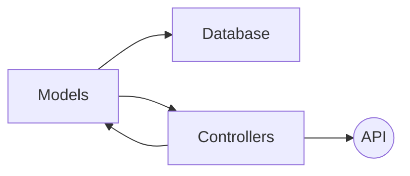
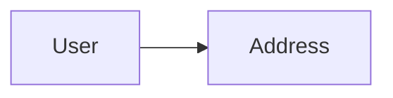
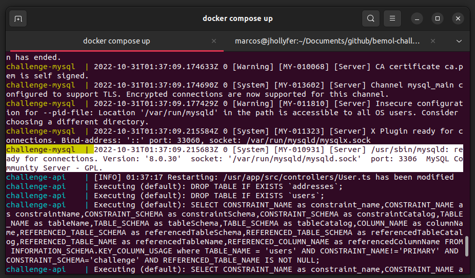
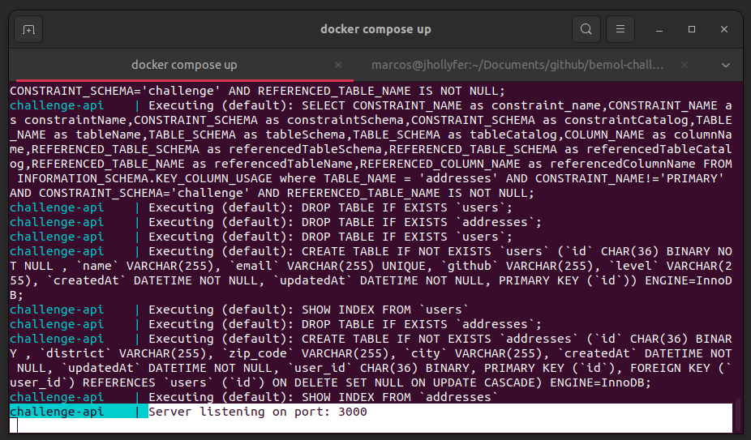

# Challenge API Bemol

Este pacote é destinado a aplicação de server-side de nossa aplicação, tratando-se de um servidor NodeJS com Express, utilizando Sequelize ORM com conexão ao MySQL

> Obs: Para que o client-side realize cadastros, é necessário que este módulo/pacote esteja em execução

## Features

- [x] Cadastro de Usuário
- [x] Validação de Usuário
- [x] Criptografia
- [x] Geração de Token

## Arquitetura

Adotando a fomosa arquitetura MVC (Model, View e Controller), o servidor irá gerir e gerenciar as regras de negócios de nossa aplicação, com o intuito de dividir e organizar a plicação em camadas.
A Model será a responsável por definir as nossas regras, criptografia, persistência de dados, receber disparos de eventos e gatilhos para captura ou inserção de dados.
Já o Controller, deverá ser o ator que realizará os disparos de gatilhos e funcionalidades para a Model, enviando e obtendo informações da View (bosso Client-side) e/ou da API. Em nossa arquitetura iremos adicionar a API como ator, pois a mesma fará a comunicação com a nosso client-side.

Abaixo um diagrama representando o nosso server-side



## Entidade X Relacionamento

Esta aplicação possui duas tabelas relacionadas para a persistência de dados, através das mesmas é possível gerenciar as informações e fornece-las para as camadas de nível mais alto como os controllers e as views.

Um usuário deverá possuir um endereço e, um endereço deve pertencer à um usuário, conforme o diagrama abaixo:



## Endpoints e Base URL

A aplicação possui por hora possui apenas a rota de cadastro de usuário atrelado a um endereço, tendo como url: `http://localhost:3000/v1` e como endpoint: `POST /user`

1. Exemplo de Requisição (Body JSON)
```
{
   "name": "Jhollyfer Rodrigues",
   "email": "jhollyferr@gmail.com",
   "github": "https://github.com/jhollyferr",
   "level": "Inciante",
   "address": {
   	"zip_code": "69104015",
   	"road": "Nossa Senhora do Rosário",
   	"district": "Santo Antonio",
   	"city": "Benjamin Constant"
    }
}
```
2. Exemplo de Resposta (JSON)

    ```
    {
        "id": "7f4481f3-7604-45d6-b05e-cb7b6aaab039",
        "name": "Jhollyfer Rodrigues",
        "email": "jhollyferr@gmail.com",
        "github": "https://github.com/jhollyferr",
        "level": "Inciante",
        "createdAt": "2022-10-30T20:15:44.000Z",
        "updatedAt": "2022-10-30T20:15:44.000Z",
        "address": {
            "id": "41dbc85b-756e-4ea8-a86d-1ba4c84212b8",
            "district": "Santo Antonio",
            "zip_code": "69104015",
            "city": "Benjamin Constant",
            "createdAt": "2022-10-30T20:15:44.000Z",
            "updatedAt": "2022-10-30T20:15:44.000Z",
            "user_id": "7f4481f3-7604-45d6-b05e-cb7b6aaab039"
        }
    }
    ```

## Executanto a aplicação

Para executar aplicação é necessário que você possua o [Docker](https://docs.docker.com/desktop/install/windows-install/) em sua máquina e o [Plugin Docker Compose](https://docs.docker.com/compose/install/), após isso:

1. Acesse este diretório (packages/api)
2. Abra o Terminal na raiz do diretório
3. Pare a execução de todos os volumes, imagens e containers, caso já possua o Docker e o Docker Componse
   `docker system prune -a --volumes --images` ou `sudo docker system prune -a --volumes --images`
   e
   `docker compose down` ou `sudo docker compose down`
4. Execute o seguinte comando
   `docker compose up` ou `sudo docker compose up`
   Com isso o Docker irá gerenciar a instalação das dependências da aplicação e definir as configurações da base de dados, desta forma você deve obter o seguinte resultado do MySQL sendo executando em um container Docker (destaque em branco)
   
   E o nosso servidor em outro container executando na porta 3000 conforme mostra a imagem abaixo
   
5. Caso a conexão do servidor ao MySQL não seja estabelecida, acesse o arquivo `server.ts` e com o teclado dê um `CTRL + S` para salvar e dar refresh na aplicação, dessa forma o servidor irá reconectar à base de dados
````
