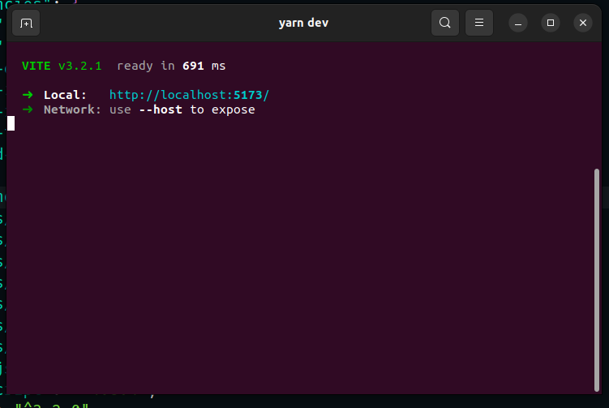
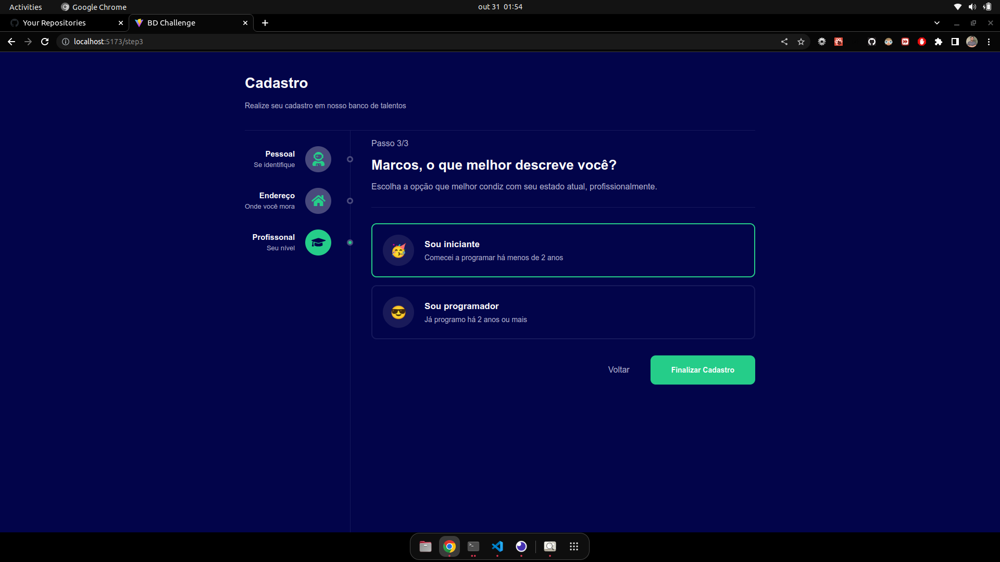

# Challenge Web Bemol

Este pacote é destinado a aplicação de client-side de nossa aplicação, sendo uma aplicação web implementado com React JS

> Obs: É importante que o server-side/api estejá em execução para que as requisições de cadastro sejam efetuadas com sucesso

## Features

- [x] Cadastro de Usuário
- [x] Validação de Input
- [x] Roteamento de Páginas
- [x] Requisições a APIs

## Dependências

- [x] Axios
- [x] React-Icons
- [x] Styled-Components
- [x] React-Toastify

## Executanto a aplicação

Para executar aplicação é necessário que você possua o [NodeJs](https://www.digitalocean.com/community/tutorials/how-to-install-node-js-on-ubuntu-20-04) na versão 16.17.X e o [Yarn](https://classic.yarnpkg.com/lang/en/docs/install/#debian-stable) na sua máquina

1. Acesse o ditetório WEB (packages/web)
2. Abra o terminal na raiz deste diretório
3. Instale as dependências com o seguinte comando `yarn`
4. Execute a aplicação com `yarn dev`

Você téra o seguinte resultado

Ao acessar o link da imagem em um navegador você terá a nossa página de cadastros funcionando e pronto pra execução

